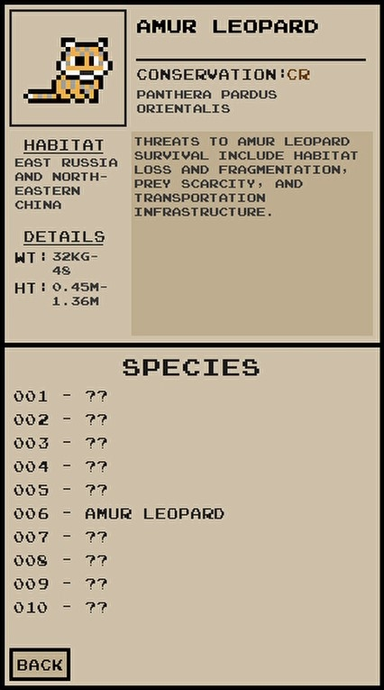
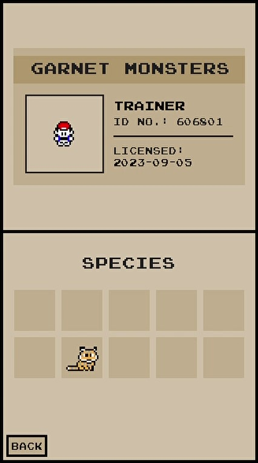

# _Garnet Monsters_

## Overview

An adventure game inspired by Nintendo's _Pok&eacute;mon_ games that teaches players about endangered species.

## Table of Contents

- [Installation](#installation)
- [Usage](#usage)
- [Features](#features)
- [Technologies Used](#technologies-used)
- [Contributors](#contributors)

## Installation

1. Clone this repository.
```bash
git clone https://github.com/elliot-d-kim/garnet-monsters.git
```
2. Navigate to the project directory.
```bash
cd garnet-monsters
```
3. Install [Python 3.8](https://www.python.org/downloads/release/python-3810/)
4. Start the game.
```bash
py -3.8 main.py
```

## Usage

The objective of _Garnet Monsters_ is to analyze and learn about all the endangered animals in the game. Use your arrow keys and mouse to navigate and interact with the game world. 

Head into the tall grass to encounter animals and analyze them.


Collect berries off bushes and use them throughout encounters for a better chance at a successful analysis.   


Check out your analyzed animals in the Journal.



Don't forget to save your progress! Load your save file from the start screen when you're back for more.


## Features

- Visually captivating game world
- Bag for collected berries
- Unique player profile
- Save and load progress




## Technologies Used

- Python 3.8
- PyGame
- PyCharm IDE


## Contributors

- Eduardo Aguilar (GitHub: @eduardo1822)
- Sophia Lu (GitHub: @xoiaxx)
- Elliott Hendricks (GitHub: @icepillow)
- Elliot Kim (GitHub: @elliot-d-kim)

## Acknowledgements

_Garnet Monsters_ was a project for Professor Michael Wehar's CPSC 71 Software Engineering course in Fall 2022. Thanks to Professor Wehar for his guidance.